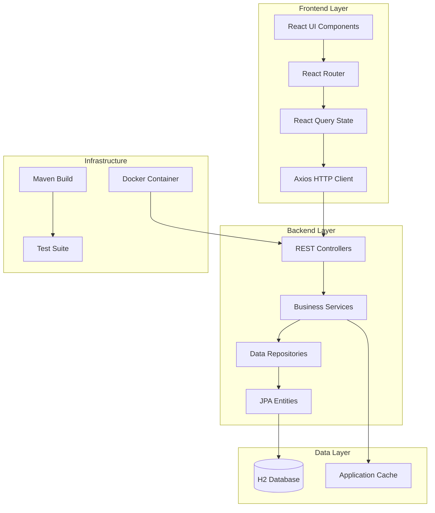
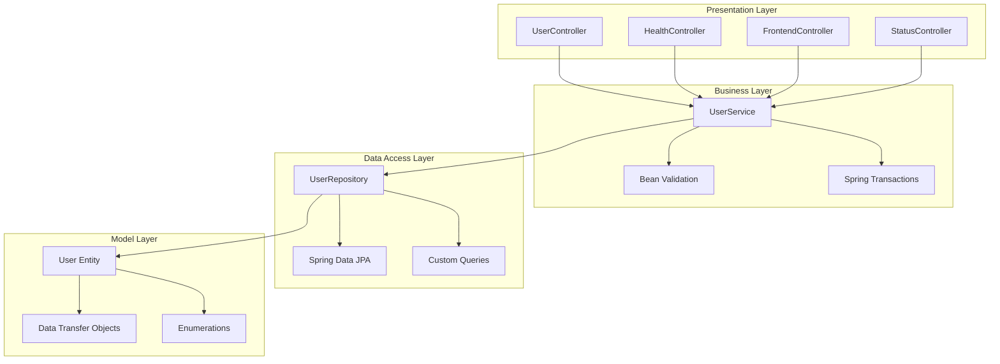
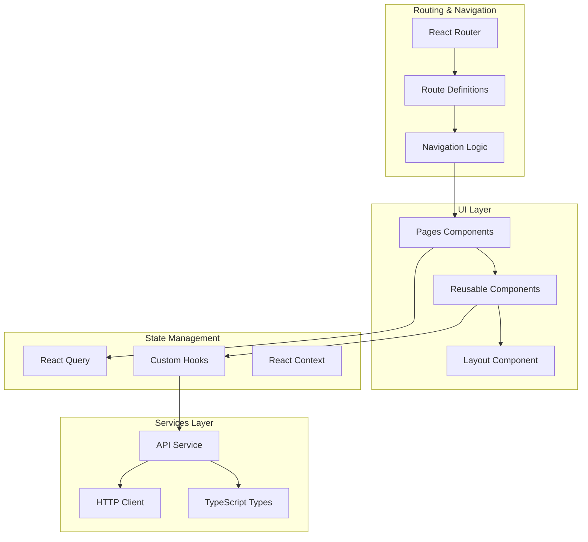
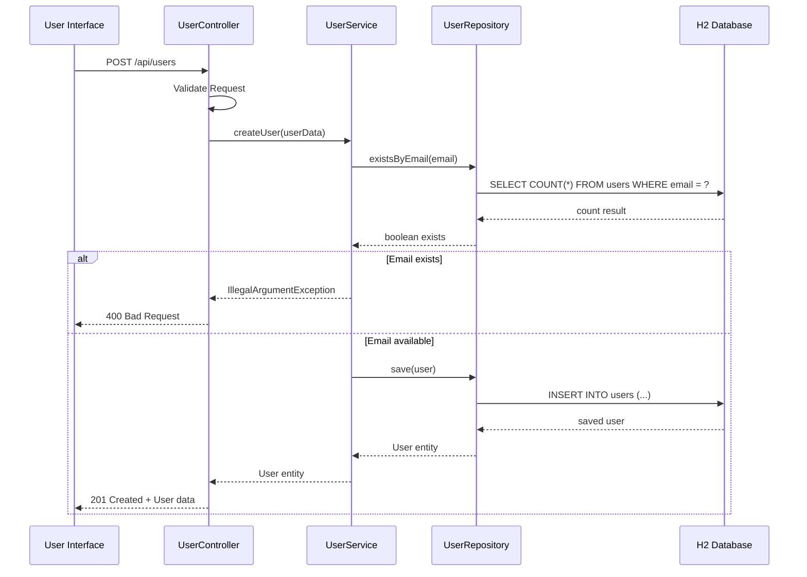
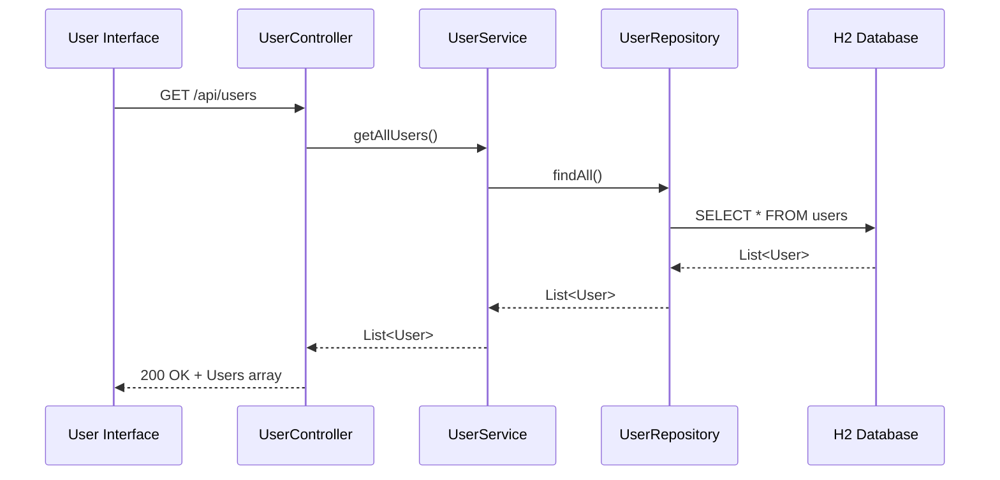
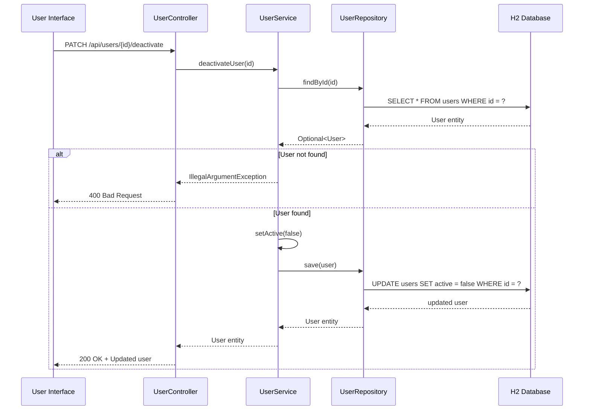

# Arquitetura da Aplicação User Management

**Autor:** Agente de Desenvolvimento  
**Data:** 2024-01-15  
**Versão:** 1.0.0  

## Resumo Executivo

A User Management Application é uma aplicação full-stack moderna construída com Spring Boot (backend) e React (frontend), implementando uma arquitetura em camadas com separação clara de responsabilidades. A aplicação oferece funcionalidades completas de CRUD para gerenciamento de usuários, com interface web responsiva e API REST robusta.

### Principais Características:
- **Backend**: Spring Boot 2.7.0 com Java 11
- **Frontend**: React 19 com Chakra UI e TypeScript
- **Banco de Dados**: H2 em memória para desenvolvimento
- **Containerização**: Docker e Docker Compose
- **Testes**: Cobertura completa com JUnit e JaCoCo
- **Qualidade**: Checkstyle, SpotBugs e PMD

## Contexto

### Problema
Necessidade de uma aplicação para gerenciamento de usuários com:
- Interface intuitiva e responsiva
- API REST para integração com outros sistemas
- Validação robusta de dados
- Operações de ativação/desativação (soft delete)
- Estatísticas e relatórios
- Facilidade de deployment e manutenção

### Requisitos
- **Funcionais**: CRUD completo, busca avançada, estatísticas
- **Não-funcionais**: Performance, escalabilidade, manutenibilidade
- **Técnicos**: Java 11+, React 19+, containerização

## Arquitetura

### Visão Geral da Arquitetura



### Arquitetura em Camadas (Backend)



### Arquitetura do Frontend



## Fluxo de Dados / Sequência

### Fluxo de Criação de Usuário



### Fluxo de Busca de Usuários



### Fluxo de Ativação/Desativação



## Boas Práticas e Padrões Adotados

### Backend (Spring Boot)

#### 1. Arquitetura em Camadas
- **Controller**: Responsável pela exposição da API REST
- **Service**: Contém a lógica de negócio
- **Repository**: Gerencia o acesso aos dados
- **Model**: Representa as entidades do domínio

#### 2. Padrões de Design
- **Dependency Injection**: Uso do `@Autowired` para injeção de dependências
- **Repository Pattern**: Abstração do acesso aos dados
- **DTO Pattern**: Transferência de dados entre camadas
- **Builder Pattern**: Construção de objetos complexos

#### 3. Validação e Tratamento de Erros
```java
// Validação com Bean Validation
@NotBlank(message = "Nome é obrigatório")
@Size(min = 2, max = 100, message = "Nome deve ter entre 2 e 100 caracteres")
private String name;

// Tratamento de exceções
@ExceptionHandler(IllegalArgumentException.class)
public ResponseEntity<ErrorResponse> handleValidationException(IllegalArgumentException e) {
    return ResponseEntity.badRequest().body(new ErrorResponse(e.getMessage()));
}
```

#### 4. Transações e Performance
```java
@Transactional(readOnly = true)  // Para operações de leitura
public List<User> getAllUsers() {
    return userRepository.findAll();
}

@Transactional  // Para operações de escrita
public User createUser(User user) {
    // Lógica de negócio
}
```

### Frontend (React)

#### 1. Arquitetura de Componentes
- **Pages**: Componentes de página principal
- **Components**: Componentes reutilizáveis
- **Hooks**: Lógica de estado customizada
- **Services**: Camada de comunicação com API

#### 2. Gerenciamento de Estado
```typescript
// React Query para cache e sincronização
const { data: users, isLoading, error } = useQuery({
  queryKey: ['users'],
  queryFn: fetchUsers,
  staleTime: 5 * 60 * 1000, // 5 minutos
});
```

#### 3. Validação de Formulários
```typescript
// React Hook Form com Yup
const schema = yup.object({
  name: yup.string().required('Nome é obrigatório').min(2, 'Mínimo 2 caracteres'),
  email: yup.string().email('Email inválido').required('Email é obrigatório'),
});
```

#### 4. TypeScript para Type Safety
```typescript
interface User {
  id: number;
  name: string;
  email: string;
  phone?: string;
  age?: number;
  active: boolean;
  createdAt: string;
  updatedAt?: string;
}
```

## Exemplos de Uso

### API REST - Criar Usuário

```bash
curl -X POST http://localhost:8080/api/users \
  -H "Content-Type: application/json" \
  -d '{
    "name": "João Silva",
    "email": "joao@email.com",
    "phone": "11999999999",
    "age": 30
  }'
```

**Resposta:**
```json
{
  "id": 1,
  "name": "João Silva",
  "email": "joao@email.com",
  "phone": "11999999999",
  "age": 30,
  "active": true,
  "createdAt": "2024-01-15T10:30:00",
  "updatedAt": null
}
```

### API REST - Buscar Usuários com Filtros

```bash
# Buscar usuários ativos
curl http://localhost:8080/api/users/active

# Buscar por nome
curl "http://localhost:8080/api/users/search?name=João"

# Buscar por faixa etária
curl "http://localhost:8080/api/users/age-range?minAge=25&maxAge=35"
```

### Frontend - Hook Customizado

```typescript
// hooks/useUsers.ts
export const useUsers = () => {
  return useQuery({
    queryKey: ['users'],
    queryFn: async () => {
      const response = await api.get('/api/users');
      return response.data;
    },
  });
};

// Uso no componente
const UsersPage = () => {
  const { data: users, isLoading, error } = useUsers();
  
  if (isLoading) return <Spinner />;
  if (error) return <ErrorMessage error={error} />;
  
  return <UserTable users={users} />;
};
```

### Frontend - Formulário com Validação

```typescript
const UserForm = () => {
  const { register, handleSubmit, formState: { errors } } = useForm<UserFormData>({
    resolver: yupResolver(schema)
  });
  
  const onSubmit = async (data: UserFormData) => {
    try {
      await api.post('/api/users', data);
      toast.success('Usuário criado com sucesso!');
    } catch (error) {
      toast.error('Erro ao criar usuário');
    }
  };
  
  return (
    <form onSubmit={handleSubmit(onSubmit)}>
      <FormControl isInvalid={!!errors.name}>
        <FormLabel>Nome</FormLabel>
        <Input {...register('name')} />
        <FormErrorMessage>{errors.name?.message}</FormErrorMessage>
      </FormControl>
      {/* Outros campos... */}
    </form>
  );
};
```

## Riscos e Considerações

### Riscos Técnicos

#### 1. **Banco de Dados H2 em Memória**
- **Risco**: Perda de dados ao reiniciar a aplicação
- **Mitigação**: 
  - Usar H2 em arquivo para produção
  - Implementar backup automático
  - Considerar migração para PostgreSQL/MySQL

#### 2. **Falta de Autenticação/Autorização**
- **Risco**: Acesso não autorizado aos dados
- **Mitigação**:
  - Implementar Spring Security
  - Adicionar JWT tokens
  - Configurar CORS adequadamente

#### 3. **Performance com Grande Volume de Dados**
- **Risco**: Lentidão em consultas com muitos usuários
- **Mitigação**:
  - Implementar paginação
  - Adicionar índices no banco
  - Usar cache Redis

### Riscos de Negócio

#### 1. **Validação de Email Duplicado**
- **Risco**: Race condition em criação simultânea
- **Mitigação**: Constraint unique no banco de dados

#### 2. **Soft Delete vs Hard Delete**
- **Risco**: Inconsistência de dados
- **Mitigação**: Política clara de retenção de dados

### Considerações de Escalabilidade

#### 1. **Monolito vs Microserviços**
- **Atual**: Aplicação monolítica
- **Futuro**: Considerar separação em microserviços se necessário

#### 2. **Banco de Dados**
- **Atual**: H2 em memória
- **Futuro**: PostgreSQL/MySQL para produção

#### 3. **Cache**
- **Atual**: Sem cache
- **Futuro**: Redis para cache de consultas frequentes

## Decisões Arquiteturais (ADR)

### ADR-001: Uso do Spring Boot
- **Contexto**: Necessidade de framework Java robusto e produtivo
- **Decisão**: Adotar Spring Boot 2.7.0
- **Consequências**: 
  - ✅ Desenvolvimento rápido
  - ✅ Ecossistema maduro
  - ❌ Curva de aprendizado
  - ❌ Overhead de dependências

### ADR-002: H2 Database para Desenvolvimento
- **Contexto**: Necessidade de banco simples para desenvolvimento
- **Decisão**: Usar H2 em memória
- **Consequências**:
  - ✅ Setup simples
  - ✅ Sem configuração externa
  - ❌ Dados não persistem
  - ❌ Limitações de performance

### ADR-003: React com Chakra UI
- **Contexto**: Interface moderna e responsiva
- **Decisão**: React 19 + Chakra UI + TypeScript
- **Consequências**:
  - ✅ Componentes prontos
  - ✅ Type safety
  - ✅ Boa experiência do desenvolvedor
  - ❌ Bundle size maior

### ADR-004: Arquitetura em Camadas
- **Contexto**: Separação clara de responsabilidades
- **Decisão**: Controller → Service → Repository → Model
- **Consequências**:
  - ✅ Código organizado
  - ✅ Testabilidade
  - ✅ Manutenibilidade
  - ❌ Mais complexidade inicial

## Referências

- [Spring Boot Documentation](https://spring.io/projects/spring-boot)
- [React Documentation](https://react.dev/)
- [Chakra UI Documentation](https://chakra-ui.com/)
- [H2 Database Documentation](http://www.h2database.com/)
- [Docker Documentation](https://docs.docker.com/)
- [Maven Documentation](https://maven.apache.org/)
- [JaCoCo Documentation](https://www.jacoco.org/)
- [Architecture Decision Records](https://adr.github.io/)
