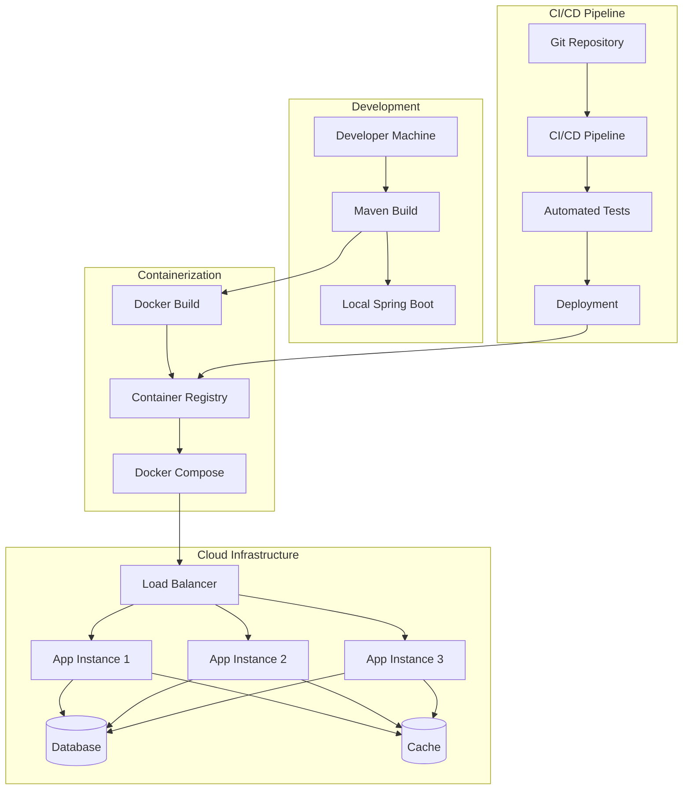
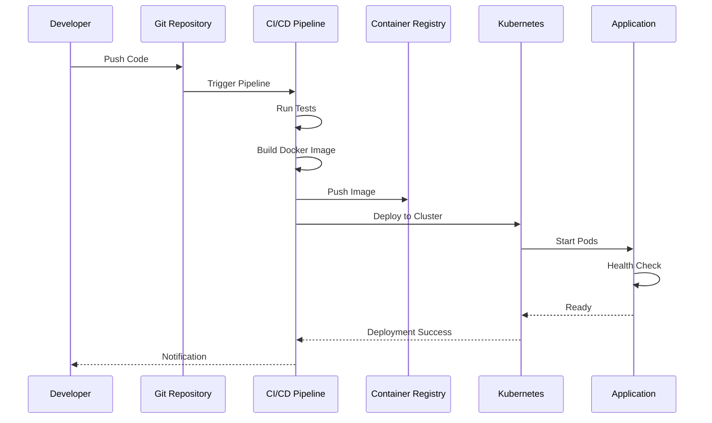

# Documentação de Deployment - User Management

**Autor:** Agente de Desenvolvimento  
**Data:** 2024-01-15  
**Versão:** 1.0.0  

## Sumário

- [Resumo Executivo](#resumo-executivo)
- [Contexto](#contexto)
- [Ambientes](#ambientes)
- [Desenvolvimento Local](#desenvolvimento-local)
- [Containerização](#containerização)
- [Deployment em Produção](#deployment-em-produção)
- [CI/CD](#cicd)
- [Monitoramento](#monitoramento)
- [Backup e Recuperação](#backup-e-recuperação)
- [Segurança](#segurança)
- [Performance](#performance)
- [Troubleshooting](#troubleshooting)
- [Checklist de Deployment](#checklist-de-deployment)

## Resumo Executivo

A User Management Application suporta múltiplas estratégias de deployment, desde desenvolvimento local até ambientes de produção. A aplicação utiliza Docker para containerização, Maven para build e pode ser deployada em diferentes plataformas cloud.

### Estratégias de Deployment:
- **Desenvolvimento Local**: Maven + Spring Boot
- **Containerização**: Docker + Docker Compose
- **Cloud**: AWS, Azure, Google Cloud
- **CI/CD**: GitHub Actions, Jenkins
- **Orquestração**: Kubernetes (futuro)

## Contexto

### Objetivo
Fornecer um processo de deployment robusto e automatizado que:
- Simplifique o processo de build e deploy
- Garanta consistência entre ambientes
- Suporte escalabilidade horizontal
- Facilite rollbacks e atualizações
- Mantenha alta disponibilidade

### Ambientes Suportados
- **Development**: Desenvolvimento local
- **Staging**: Ambiente de testes
- **Production**: Ambiente de produção

## Arquitetura de Deployment

### Visão Geral



### Fluxo de Deployment



## Estratégias de Deployment

### 1. Desenvolvimento Local

#### Pré-requisitos
- Java 11 ou superior
- Maven 3.6 ou superior
- IDE (IntelliJ IDEA, Eclipse, VS Code)

#### Build e Execução
```bash
# Clone do repositório
git clone <repository-url>
cd example-java-maven

# Build da aplicação
mvn clean install

# Execução
mvn spring-boot:run
```

#### Configurações
```properties
# application.properties
spring.application.name=User Management Application
server.port=8080
spring.datasource.url=jdbc:h2:mem:testdb
spring.datasource.username=sa
spring.datasource.password=password
spring.h2.console.enabled=true
```

### 2. Containerização com Docker

#### Dockerfile

```dockerfile
# Use OpenJDK 11 as base image
FROM openjdk:11-jre-slim

# Set working directory
WORKDIR /app

# Copy the JAR file from target directory
COPY target/user-management-app-1.0.0.jar app.jar

# Expose port 8080
EXPOSE 8080

# Add health check
HEALTHCHECK --interval=30s --timeout=3s --start-period=5s --retries=3 \
  CMD curl -f http://localhost:8080/api/users || exit 1

# Run the application
ENTRYPOINT ["java", "-jar", "app.jar"]
```

#### Docker Compose

```yaml
version: '3.8'

services:
  user-management-app:
    build:
      context: .
      dockerfile: Dockerfile
    container_name: user-management-app
    ports:
      - "8080:8080"
    environment:
      - SPRING_PROFILES_ACTIVE=docker
      - SPRING_DATASOURCE_URL=jdbc:h2:mem:testdb
      - SPRING_DATASOURCE_USERNAME=sa
      - SPRING_DATASOURCE_PASSWORD=password
      - SPRING_H2_CONSOLE_ENABLED=true
    networks:
      - user-management-network
    restart: unless-stopped
    healthcheck:
      test: ["CMD", "curl", "-f", "http://localhost:8080/api/users"]
      interval: 30s
      timeout: 10s
      retries: 3
      start_period: 40s

networks:
  user-management-network:
    driver: bridge
```

#### Script de Automação

```bash
#!/bin/bash

# Script para build e execução da aplicação User Management com Docker

echo "🐳 Iniciando build e execução da aplicação User Management com Docker..."

# Parar containers existentes
echo "🛑 Parando containers existentes..."
docker-compose down

# Build da aplicação Maven
echo "🔨 Fazendo build da aplicação Maven..."
mvn clean package -DskipTests

# Verificar se o build foi bem-sucedido
if [ $? -ne 0 ]; then
    echo "❌ Erro no build Maven. Abortando..."
    exit 1
fi

# Build da imagem Docker
echo "🏗️  Fazendo build da imagem Docker..."
docker-compose build

# Verificar se o build Docker foi bem-sucedido
if [ $? -ne 0 ]; then
    echo "❌ Erro no build Docker. Abortando..."
    exit 1
fi

# Executar a aplicação
echo "🚀 Iniciando a aplicação..."
docker-compose up -d

# Aguardar a aplicação inicializar
echo "⏳ Aguardando a aplicação inicializar..."
sleep 10

# Verificar se a aplicação está rodando
echo "🔍 Verificando status da aplicação..."
docker-compose ps

# Testar endpoint
echo "🧪 Testando endpoint da aplicação..."
curl -f http://localhost:8080/api/users

if [ $? -eq 0 ]; then
    echo ""
    echo "✅ Aplicação iniciada com sucesso!"
    echo "📱 API disponível em: http://localhost:8080/api/users"
    echo "🗄️  Console H2 disponível em: http://localhost:8080/h2-console"
    echo "📊 Estatísticas disponíveis em: http://localhost:8080/api/users/stats"
    echo ""
    echo "Para parar a aplicação, execute: docker-compose down"
else
    echo "❌ Erro ao testar a aplicação. Verifique os logs com: docker-compose logs"
fi
```

### 3. Deployment em Cloud

#### AWS Deployment

##### ECS (Elastic Container Service)

```yaml
# ecs-task-definition.json
{
  "family": "user-management-app",
  "networkMode": "awsvpc",
  "requiresCompatibilities": ["FARGATE"],
  "cpu": "256",
  "memory": "512",
  "executionRoleArn": "arn:aws:iam::account:role/ecsTaskExecutionRole",
  "containerDefinitions": [
    {
      "name": "user-management-app",
      "image": "account.dkr.ecr.region.amazonaws.com/user-management-app:latest",
      "portMappings": [
        {
          "containerPort": 8080,
          "protocol": "tcp"
        }
      ],
      "environment": [
        {
          "name": "SPRING_PROFILES_ACTIVE",
          "value": "production"
        },
        {
          "name": "SPRING_DATASOURCE_URL",
          "value": "jdbc:postgresql://rds-endpoint:5432/usermanagement"
        }
      ],
      "secrets": [
        {
          "name": "SPRING_DATASOURCE_USERNAME",
          "valueFrom": "arn:aws:secretsmanager:region:account:secret:db-username"
        },
        {
          "name": "SPRING_DATASOURCE_PASSWORD",
          "valueFrom": "arn:aws:secretsmanager:region:account:secret:db-password"
        }
      ],
      "logConfiguration": {
        "logDriver": "awslogs",
        "options": {
          "awslogs-group": "/ecs/user-management-app",
          "awslogs-region": "us-east-1",
          "awslogs-stream-prefix": "ecs"
        }
      },
      "healthCheck": {
        "command": ["CMD-SHELL", "curl -f http://localhost:8080/api/users || exit 1"],
        "interval": 30,
        "timeout": 5,
        "retries": 3,
        "startPeriod": 60
      }
    }
  ]
}
```

##### CloudFormation Template

```yaml
# cloudformation-template.yaml
AWSTemplateFormatVersion: '2010-09-09'
Description: 'User Management Application Infrastructure'

Parameters:
  Environment:
    Type: String
    Default: production
    AllowedValues: [development, staging, production]
  
  VpcId:
    Type: AWS::EC2::VPC::Id
    Description: VPC ID where resources will be created

Resources:
  # ECS Cluster
  ECSCluster:
    Type: AWS::ECS::Cluster
    Properties:
      ClusterName: !Sub 'user-management-${Environment}'
      CapacityProviders:
        - FARGATE
        - FARGATE_SPOT

  # ECS Service
  ECSService:
    Type: AWS::ECS::Service
    Properties:
      ServiceName: !Sub 'user-management-service-${Environment}'
      Cluster: !Ref ECSCluster
      TaskDefinition: !Ref TaskDefinition
      DesiredCount: 2
      LaunchType: FARGATE
      NetworkConfiguration:
        AwsvpcConfiguration:
          SecurityGroups:
            - !Ref SecurityGroup
          Subnets:
            - !Ref Subnet1
            - !Ref Subnet2
          AssignPublicIp: ENABLED
      LoadBalancers:
        - ContainerName: user-management-app
          ContainerPort: 8080
          TargetGroupArn: !Ref TargetGroup

  # Application Load Balancer
  ApplicationLoadBalancer:
    Type: AWS::ElasticLoadBalancingV2::LoadBalancer
    Properties:
      Name: !Sub 'user-management-alb-${Environment}'
      Scheme: internet-facing
      Type: application
      Subnets:
        - !Ref Subnet1
        - !Ref Subnet2
      SecurityGroups:
        - !Ref ALBSecurityGroup

  # Target Group
  TargetGroup:
    Type: AWS::ElasticLoadBalancingV2::TargetGroup
    Properties:
      Name: !Sub 'user-management-tg-${Environment}'
      Port: 8080
      Protocol: HTTP
      VpcId: !Ref VpcId
      TargetType: ip
      HealthCheckPath: /api/users
      HealthCheckProtocol: HTTP
      HealthCheckIntervalSeconds: 30
      HealthCheckTimeoutSeconds: 5
      HealthyThresholdCount: 2
      UnhealthyThresholdCount: 3

  # Security Group
  SecurityGroup:
    Type: AWS::EC2::SecurityGroup
    Properties:
      GroupName: !Sub 'user-management-sg-${Environment}'
      GroupDescription: Security group for User Management Application
      VpcId: !Ref VpcId
      SecurityGroupIngress:
        - IpProtocol: tcp
          FromPort: 8080
          ToPort: 8080
          SourceSecurityGroupId: !Ref ALBSecurityGroup

  # ALB Security Group
  ALBSecurityGroup:
    Type: AWS::EC2::SecurityGroup
    Properties:
      GroupName: !Sub 'user-management-alb-sg-${Environment}'
      GroupDescription: Security group for Application Load Balancer
      VpcId: !Ref VpcId
      SecurityGroupIngress:
        - IpProtocol: tcp
          FromPort: 80
          ToPort: 80
          CidrIp: 0.0.0.0/0
        - IpProtocol: tcp
          FromPort: 443
          ToPort: 443
          CidrIp: 0.0.0.0/0

  # RDS Database
  Database:
    Type: AWS::RDS::DBInstance
    Properties:
      DBInstanceIdentifier: !Sub 'user-management-db-${Environment}'
      DBName: usermanagement
      DBInstanceClass: db.t3.micro
      Engine: postgres
      EngineVersion: '13.7'
      MasterUsername: !Ref DatabaseUsername
      MasterUserPassword: !Ref DatabasePassword
      AllocatedStorage: 20
      StorageType: gp2
      VPCSecurityGroups:
        - !Ref DatabaseSecurityGroup
      DBSubnetGroupName: !Ref DBSubnetGroup
      BackupRetentionPeriod: 7
      MultiAZ: false
      PubliclyAccessible: false

  # Database Security Group
  DatabaseSecurityGroup:
    Type: AWS::EC2::SecurityGroup
    Properties:
      GroupName: !Sub 'user-management-db-sg-${Environment}'
      GroupDescription: Security group for RDS Database
      VpcId: !Ref VpcId
      SecurityGroupIngress:
        - IpProtocol: tcp
          FromPort: 5432
          ToPort: 5432
          SourceSecurityGroupId: !Ref SecurityGroup

Outputs:
  ApplicationURL:
    Description: URL of the application
    Value: !Sub 'http://${ApplicationLoadBalancer.DNSName}'
    Export:
      Name: !Sub '${AWS::StackName}-ApplicationURL'
  
  DatabaseEndpoint:
    Description: RDS Database Endpoint
    Value: !GetAtt Database.Endpoint.Address
    Export:
      Name: !Sub '${AWS::StackName}-DatabaseEndpoint'
```

#### Azure Deployment

##### Azure Container Instances

```yaml
# azure-container-instance.yaml
apiVersion: 2018-10-01
location: eastus
name: user-management-app
properties:
  containers:
  - name: user-management-app
    properties:
      image: user-management-app:latest
      ports:
      - port: 8080
        protocol: TCP
      environmentVariables:
      - name: SPRING_PROFILES_ACTIVE
        value: production
      - name: SPRING_DATASOURCE_URL
        value: jdbc:postgresql://azure-postgres:5432/usermanagement
      resources:
        requests:
          cpu: 0.5
          memoryInGb: 1.0
  osType: Linux
  restartPolicy: Always
  ipAddress:
    type: Public
    ports:
    - protocol: TCP
      port: 8080
    dnsNameLabel: user-management-app
tags:
  environment: production
type: Microsoft.ContainerInstance/containerGroups
```

##### Azure Resource Manager Template

```json
{
  "$schema": "https://schema.management.azure.com/schemas/2019-04-01/deploymentTemplate.json#",
  "contentVersion": "1.0.0.0",
  "parameters": {
    "environment": {
      "type": "string",
      "defaultValue": "production",
      "allowedValues": ["development", "staging", "production"]
    },
    "location": {
      "type": "string",
      "defaultValue": "[resourceGroup().location]"
    }
  },
  "variables": {
    "appName": "[concat('user-management-', parameters('environment'))]",
    "containerImage": "user-management-app:latest"
  },
  "resources": [
    {
      "type": "Microsoft.ContainerInstance/containerGroups",
      "apiVersion": "2019-12-01",
      "name": "[variables('appName')]",
      "location": "[parameters('location')]",
      "properties": {
        "containers": [
          {
            "name": "user-management-app",
            "properties": {
              "image": "[variables('containerImage')]",
              "ports": [
                {
                  "port": 8080,
                  "protocol": "TCP"
                }
              ],
              "environmentVariables": [
                {
                  "name": "SPRING_PROFILES_ACTIVE",
                  "value": "production"
                }
              ],
              "resources": {
                "requests": {
                  "cpu": 0.5,
                  "memoryInGb": 1.0
                }
              }
            }
          }
        ],
        "osType": "Linux",
        "restartPolicy": "Always",
        "ipAddress": {
          "type": "Public",
          "ports": [
            {
              "protocol": "TCP",
              "port": 8080
            }
          ],
          "dnsNameLabel": "[variables('appName')]"
        }
      }
    }
  ],
  "outputs": {
    "applicationUrl": {
      "type": "string",
      "value": "[concat('http://', reference(variables('appName')).ipAddress.fqdn, ':8080')]"
    }
  }
}
```

### 4. Kubernetes Deployment

#### Deployment Manifest

```yaml
# kubernetes-deployment.yaml
apiVersion: apps/v1
kind: Deployment
metadata:
  name: user-management-app
  labels:
    app: user-management-app
spec:
  replicas: 3
  selector:
    matchLabels:
      app: user-management-app
  template:
    metadata:
      labels:
        app: user-management-app
    spec:
      containers:
      - name: user-management-app
        image: user-management-app:latest
        ports:
        - containerPort: 8080
        env:
        - name: SPRING_PROFILES_ACTIVE
          value: "production"
        - name: SPRING_DATASOURCE_URL
          valueFrom:
            configMapKeyRef:
              name: app-config
              key: database-url
        - name: SPRING_DATASOURCE_USERNAME
          valueFrom:
            secretKeyRef:
              name: app-secrets
              key: database-username
        - name: SPRING_DATASOURCE_PASSWORD
          valueFrom:
            secretKeyRef:
              name: app-secrets
              key: database-password
        resources:
          requests:
            memory: "256Mi"
            cpu: "250m"
          limits:
            memory: "512Mi"
            cpu: "500m"
        livenessProbe:
          httpGet:
            path: /api/users
            port: 8080
          initialDelaySeconds: 60
          periodSeconds: 30
        readinessProbe:
          httpGet:
            path: /api/users
            port: 8080
          initialDelaySeconds: 30
          periodSeconds: 10
---
apiVersion: v1
kind: Service
metadata:
  name: user-management-service
spec:
  selector:
    app: user-management-app
  ports:
  - protocol: TCP
    port: 80
    targetPort: 8080
  type: LoadBalancer
---
apiVersion: v1
kind: ConfigMap
metadata:
  name: app-config
data:
  database-url: "jdbc:postgresql://postgres-service:5432/usermanagement"
---
apiVersion: v1
kind: Secret
metadata:
  name: app-secrets
type: Opaque
data:
  database-username: <base64-encoded-username>
  database-password: <base64-encoded-password>
```

#### Helm Chart

```yaml
# Chart.yaml
apiVersion: v2
name: user-management-app
description: User Management Application Helm Chart
type: application
version: 1.0.0
appVersion: "1.0.0"

# values.yaml
replicaCount: 3

image:
  repository: user-management-app
  tag: latest
  pullPolicy: IfNotPresent

service:
  type: LoadBalancer
  port: 80
  targetPort: 8080

ingress:
  enabled: true
  className: nginx
  annotations:
    nginx.ingress.kubernetes.io/rewrite-target: /
  hosts:
    - host: user-management.example.com
      paths:
        - path: /
          pathType: Prefix

resources:
  limits:
    cpu: 500m
    memory: 512Mi
  requests:
    cpu: 250m
    memory: 256Mi

autoscaling:
  enabled: true
  minReplicas: 2
  maxReplicas: 10
  targetCPUUtilizationPercentage: 70
  targetMemoryUtilizationPercentage: 80

database:
  enabled: true
  type: postgresql
  host: postgres-service
  port: 5432
  database: usermanagement
  username: postgres
  password: password

monitoring:
  enabled: true
  serviceMonitor:
    enabled: true
    interval: 30s
    path: /actuator/prometheus
```

## CI/CD Pipeline

### GitHub Actions

```yaml
# .github/workflows/deploy.yml
name: Build and Deploy

on:
  push:
    branches: [ main, develop ]
  pull_request:
    branches: [ main ]

env:
  REGISTRY: ghcr.io
  IMAGE_NAME: ${{ github.repository }}

jobs:
  test:
    runs-on: ubuntu-latest
    steps:
    - uses: actions/checkout@v3
    
    - name: Set up JDK 11
      uses: actions/setup-java@v3
      with:
        java-version: '11'
        distribution: 'temurin'
    
    - name: Cache Maven dependencies
      uses: actions/cache@v3
      with:
        path: ~/.m2
        key: ${{ runner.os }}-m2-${{ hashFiles('**/pom.xml') }}
        restore-keys: ${{ runner.os }}-m2
    
    - name: Run tests
      run: mvn clean test
    
    - name: Generate test report
      uses: dorny/test-reporter@v1
      if: success() || failure()
      with:
        name: Maven Tests
        path: target/surefire-reports/*.xml
        reporter: java-junit

  build:
    needs: test
    runs-on: ubuntu-latest
    if: github.ref == 'refs/heads/main'
    
    steps:
    - uses: actions/checkout@v3
    
    - name: Set up JDK 11
      uses: actions/setup-java@v3
      with:
        java-version: '11'
        distribution: 'temurin'
    
    - name: Build application
      run: mvn clean package -DskipTests
    
    - name: Set up Docker Buildx
      uses: docker/setup-buildx-action@v2
    
    - name: Log in to Container Registry
      uses: docker/login-action@v2
      with:
        registry: ${{ env.REGISTRY }}
        username: ${{ github.actor }}
        password: ${{ secrets.GITHUB_TOKEN }}
    
    - name: Extract metadata
      id: meta
      uses: docker/metadata-action@v4
      with:
        images: ${{ env.REGISTRY }}/${{ env.IMAGE_NAME }}
        tags: |
          type=ref,event=branch
          type=ref,event=pr
          type=sha,prefix={{branch}}-
          type=raw,value=latest,enable={{is_default_branch}}
    
    - name: Build and push Docker image
      uses: docker/build-push-action@v4
      with:
        context: .
        push: true
        tags: ${{ steps.meta.outputs.tags }}
        labels: ${{ steps.meta.outputs.labels }}
        cache-from: type=gha
        cache-to: type=gha,mode=max

  deploy:
    needs: build
    runs-on: ubuntu-latest
    if: github.ref == 'refs/heads/main'
    
    steps:
    - uses: actions/checkout@v3
    
    - name: Configure AWS credentials
      uses: aws-actions/configure-aws-credentials@v2
      with:
        aws-access-key-id: ${{ secrets.AWS_ACCESS_KEY_ID }}
        aws-secret-access-key: ${{ secrets.AWS_SECRET_ACCESS_KEY }}
        aws-region: us-east-1
    
    - name: Deploy to ECS
      run: |
        aws ecs update-service \
          --cluster user-management-production \
          --service user-management-service \
          --force-new-deployment
```

### Jenkins Pipeline

```groovy
// Jenkinsfile
pipeline {
    agent any
    
    environment {
        DOCKER_REGISTRY = 'your-registry.com'
        IMAGE_NAME = 'user-management-app'
        AWS_REGION = 'us-east-1'
        ECS_CLUSTER = 'user-management-production'
        ECS_SERVICE = 'user-management-service'
    }
    
    stages {
        stage('Checkout') {
            steps {
                checkout scm
            }
        }
        
        stage('Test') {
            steps {
                sh 'mvn clean test'
            }
            post {
                always {
                    publishTestResults testResultsPattern: 'target/surefire-reports/*.xml'
                    publishCoverage adapters: [jacocoAdapter('target/site/jacoco/jacoco.xml')]
                }
            }
        }
        
        stage('Build') {
            steps {
                sh 'mvn clean package -DskipTests'
            }
        }
        
        stage('Docker Build') {
            steps {
                script {
                    def image = docker.build("${DOCKER_REGISTRY}/${IMAGE_NAME}:${BUILD_NUMBER}")
                    docker.withRegistry("https://${DOCKER_REGISTRY}", 'docker-registry-credentials') {
                        image.push()
                        image.push('latest')
                    }
                }
            }
        }
        
        stage('Deploy to Staging') {
            when {
                branch 'develop'
            }
            steps {
                sh """
                    aws ecs update-service \
                        --cluster user-management-staging \
                        --service user-management-service \
                        --force-new-deployment
                """
            }
        }
        
        stage('Deploy to Production') {
            when {
                branch 'main'
            }
            steps {
                input message: 'Deploy to production?', ok: 'Deploy'
                sh """
                    aws ecs update-service \
                        --cluster ${ECS_CLUSTER} \
                        --service ${ECS_SERVICE} \
                        --force-new-deployment
                """
            }
        }
    }
    
    post {
        always {
            cleanWs()
        }
        failure {
            emailext (
                subject: "Build Failed: ${env.JOB_NAME} - ${env.BUILD_NUMBER}",
                body: "Build failed. Check console output at ${env.BUILD_URL}",
                to: "${env.CHANGE_AUTHOR_EMAIL}"
            )
        }
        success {
            emailext (
                subject: "Build Successful: ${env.JOB_NAME} - ${env.BUILD_NUMBER}",
                body: "Build successful. Check console output at ${env.BUILD_URL}",
                to: "${env.CHANGE_AUTHOR_EMAIL}"
            )
        }
    }
}
```

## Monitoramento e Observabilidade

### Health Checks

```java
// HealthController.java
@RestController
@RequestMapping("/actuator")
public class HealthController {
    
    @Autowired
    private UserRepository userRepository;
    
    @GetMapping("/health")
    public ResponseEntity<Map<String, Object>> health() {
        Map<String, Object> health = new HashMap<>();
        
        try {
            // Test database connection
            userRepository.count();
            health.put("database", "UP");
        } catch (Exception e) {
            health.put("database", "DOWN");
        }
        
        health.put("status", "UP");
        health.put("timestamp", LocalDateTime.now());
        
        return ResponseEntity.ok(health);
    }
    
    @GetMapping("/ready")
    public ResponseEntity<Map<String, String>> readiness() {
        Map<String, String> ready = new HashMap<>();
        ready.put("status", "READY");
        return ResponseEntity.ok(ready);
    }
}
```

### Logging Configuration

```yaml
# logback-spring.xml
<configuration>
    <appender name="STDOUT" class="ch.qos.logback.core.ConsoleAppender">
        <encoder>
            <pattern>%d{yyyy-MM-dd HH:mm:ss} [%thread] %-5level %logger{36} - %msg%n</pattern>
        </encoder>
    </appender>
    
    <appender name="FILE" class="ch.qos.logback.core.rolling.RollingFileAppender">
        <file>logs/user-management.log</file>
        <rollingPolicy class="ch.qos.logback.core.rolling.TimeBasedRollingPolicy">
            <fileNamePattern>logs/user-management.%d{yyyy-MM-dd}.%i.log</fileNamePattern>
            <maxFileSize>100MB</maxFileSize>
            <maxHistory>30</maxHistory>
        </rollingPolicy>
        <encoder>
            <pattern>%d{yyyy-MM-dd HH:mm:ss} [%thread] %-5level %logger{36} - %msg%n</pattern>
        </encoder>
    </appender>
    
    <root level="INFO">
        <appender-ref ref="STDOUT" />
        <appender-ref ref="FILE" />
    </root>
</configuration>
```

### Metrics and Monitoring

```java
// MetricsConfiguration.java
@Configuration
@EnablePrometheusMetrics
public class MetricsConfiguration {
    
    @Bean
    public MeterRegistry meterRegistry() {
        return new PrometheusMeterRegistry(PrometheusConfig.DEFAULT);
    }
    
    @Bean
    public TimedAspect timedAspect(MeterRegistry registry) {
        return new TimedAspect(registry);
    }
}
```

## Segurança

### Container Security

```dockerfile
# Multi-stage build for security
FROM openjdk:11-jdk-slim as builder
WORKDIR /app
COPY pom.xml .
COPY src ./src
RUN mvn clean package -DskipTests

FROM openjdk:11-jre-slim
WORKDIR /app

# Create non-root user
RUN groupadd -r appuser && useradd -r -g appuser appuser

# Copy JAR file
COPY --from=builder /app/target/user-management-app-1.0.0.jar app.jar

# Change ownership
RUN chown -R appuser:appuser /app
USER appuser

EXPOSE 8080
ENTRYPOINT ["java", "-jar", "app.jar"]
```

### Secrets Management

```yaml
# kubernetes-secrets.yaml
apiVersion: v1
kind: Secret
metadata:
  name: app-secrets
type: Opaque
data:
  database-username: <base64-encoded>
  database-password: <base64-encoded>
  jwt-secret: <base64-encoded>
---
apiVersion: v1
kind: ConfigMap
metadata:
  name: app-config
data:
  database-url: "jdbc:postgresql://postgres:5432/usermanagement"
  server-port: "8080"
```

## Rollback Strategies

### Blue-Green Deployment

```bash
#!/bin/bash
# blue-green-deploy.sh

CURRENT_COLOR=$(kubectl get service user-management-service -o jsonpath='{.spec.selector.color}')
NEW_COLOR=$([ "$CURRENT_COLOR" = "blue" ] && echo "green" || echo "blue")

echo "Current color: $CURRENT_COLOR"
echo "Deploying to: $NEW_COLOR"

# Deploy new version
kubectl apply -f deployment-$NEW_COLOR.yaml

# Wait for deployment to be ready
kubectl rollout status deployment/user-management-app-$NEW_COLOR

# Switch traffic
kubectl patch service user-management-service -p '{"spec":{"selector":{"color":"'$NEW_COLOR'"}}}'

echo "Deployment completed. New color: $NEW_COLOR"
```

### Canary Deployment

```yaml
# canary-deployment.yaml
apiVersion: argoproj.io/v1alpha1
kind: Rollout
metadata:
  name: user-management-app
spec:
  replicas: 5
  strategy:
    canary:
      steps:
      - setWeight: 20
      - pause: {duration: 10m}
      - setWeight: 40
      - pause: {duration: 10m}
      - setWeight: 60
      - pause: {duration: 10m}
      - setWeight: 80
      - pause: {duration: 10m}
      canaryService: user-management-canary
      stableService: user-management-stable
      trafficRouting:
        nginx:
          stableIngress: user-management-ingress
  selector:
    matchLabels:
      app: user-management-app
  template:
    metadata:
      labels:
        app: user-management-app
    spec:
      containers:
      - name: user-management-app
        image: user-management-app:latest
        ports:
        - containerPort: 8080
```

## Troubleshooting

### Common Issues

#### 1. Application Won't Start

```bash
# Check logs
docker logs user-management-app

# Check health endpoint
curl http://localhost:8080/actuator/health

# Check database connection
curl http://localhost:8080/actuator/health/db
```

#### 2. Database Connection Issues

```bash
# Check database status
kubectl get pods -l app=postgres

# Check database logs
kubectl logs -l app=postgres

# Test database connection
kubectl exec -it postgres-pod -- psql -U postgres -d usermanagement
```

#### 3. Memory Issues

```bash
# Check memory usage
kubectl top pods

# Check JVM memory
kubectl exec -it user-management-pod -- jstat -gc 1

# Adjust memory limits
kubectl patch deployment user-management-app -p '{"spec":{"template":{"spec":{"containers":[{"name":"user-management-app","resources":{"limits":{"memory":"1Gi"}}}]}}}}'
```

### Performance Tuning

#### JVM Tuning

```bash
# JVM options for production
JAVA_OPTS="-Xms512m -Xmx1024m -XX:+UseG1GC -XX:MaxGCPauseMillis=200 -XX:+UseStringDeduplication"
```

#### Database Tuning

```sql
-- PostgreSQL tuning
ALTER SYSTEM SET shared_buffers = '256MB';
ALTER SYSTEM SET effective_cache_size = '1GB';
ALTER SYSTEM SET maintenance_work_mem = '64MB';
ALTER SYSTEM SET checkpoint_completion_target = 0.9;
ALTER SYSTEM SET wal_buffers = '16MB';
ALTER SYSTEM SET default_statistics_target = 100;
```

## Referências

- [Docker Documentation](https://docs.docker.com/)
- [Kubernetes Documentation](https://kubernetes.io/docs/)
- [AWS ECS Documentation](https://docs.aws.amazon.com/ecs/)
- [Azure Container Instances](https://docs.microsoft.com/en-us/azure/container-instances/)
- [GitHub Actions](https://docs.github.com/en/actions)
- [Jenkins Pipeline](https://www.jenkins.io/doc/book/pipeline/)
- [Helm Documentation](https://helm.sh/docs/)
- [Prometheus Monitoring](https://prometheus.io/docs/)
- [Spring Boot Actuator](https://docs.spring.io/spring-boot/docs/current/reference/html/actuator.html)
