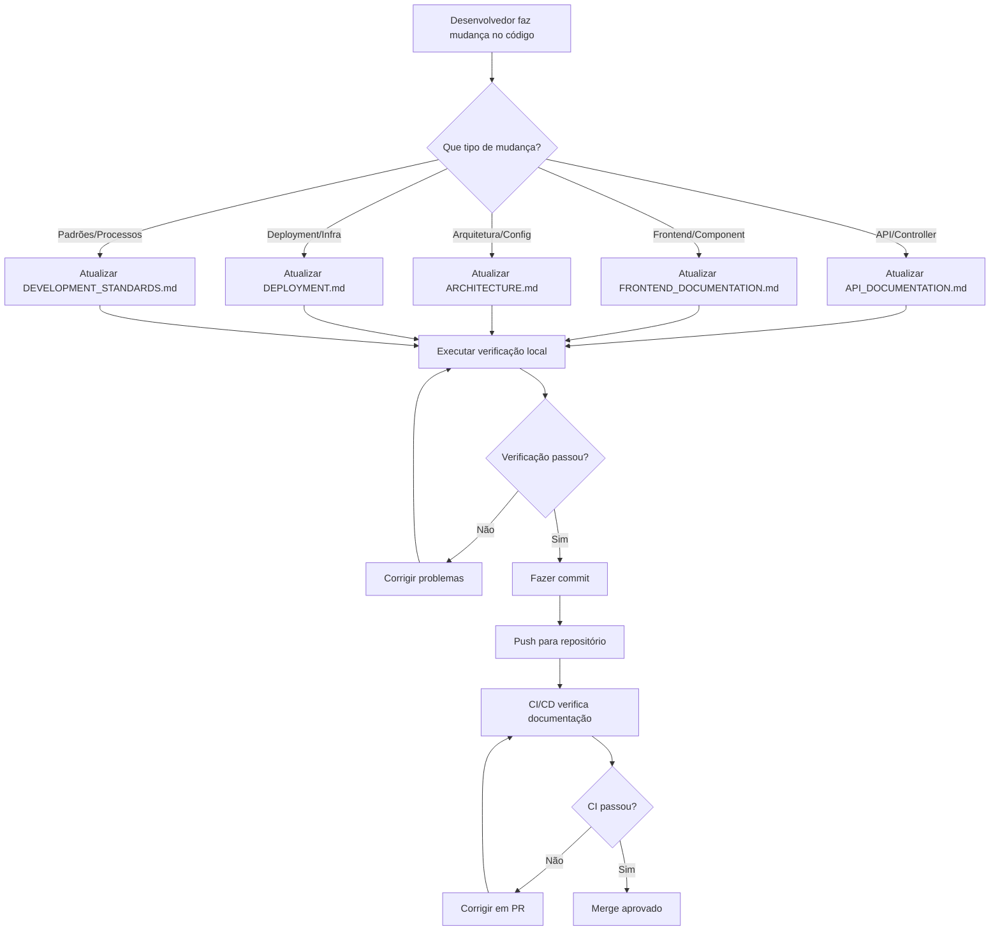

# Manutenção de Documentação

**Autor:** Agente de Desenvolvimento  
**Data:** 2024-01-15  
**Versão:** 1.0.0  

## Resumo Executivo

Este documento estabelece as diretrizes e processos para manter a documentação sempre atualizada e sincronizada com o código. A documentação é um ativo crítico do projeto e deve ser tratada com a mesma importância que o código.

### Objetivos:
- **Sincronização**: Documentação sempre atualizada com o código
- **Automação**: Processos automatizados para verificação
- **Qualidade**: Padrões consistentes de documentação
- **Colaboração**: Facilita trabalho em equipe
- **Manutenibilidade**: Documentação fácil de manter

## Princípios Fundamentais

### 1. Documentação como Código
- A documentação deve ser tratada como código
- Versionada no Git junto com o código
- Revisada em Pull Requests
- Testada e validada

### 2. Atualização Contínua
- Documentação atualizada a cada mudança de código
- Verificação automática em CI/CD
- Hooks de Git para validação
- Processo de review obrigatório

### 3. Responsabilidade Compartilhada
- Todo desenvolvedor é responsável pela documentação
- Code review inclui revisão de documentação
- Líder técnico valida mudanças arquiteturais
- Product Owner valida documentação de usuário

## Processo de Manutenção

### Fluxo de Atualização



### Checklist de Atualização

#### Para Mudanças na API
- [ ] **API_DOCUMENTATION.md**
  - [ ] Novos endpoints documentados
  - [ ] Parâmetros e validações atualizados
  - [ ] Exemplos de request/response
  - [ ] Códigos de status HTTP
  - [ ] Tratamento de erros

#### Para Mudanças no Frontend
- [ ] **FRONTEND_DOCUMENTATION.md**
  - [ ] Novos componentes documentados
  - [ ] Hooks customizados documentados
  - [ ] Props e interfaces atualizadas
  - [ ] Exemplos de uso
  - [ ] Padrões de design

#### Para Mudanças na Arquitetura
- [ ] **ARCHITECTURE.md**
  - [ ] Diagramas atualizados
  - [ ] Decisões arquiteturais (ADRs)
  - [ ] Fluxos de dados
  - [ ] Dependências e tecnologias

#### Para Mudanças no Deployment
- [ ] **DEPLOYMENT.md**
  - [ ] Scripts de deployment
  - [ ] Configurações de ambiente
  - [ ] Processos de CI/CD
  - [ ] Monitoramento e logs

#### Para Mudanças nos Padrões
- [ ] **DEVELOPMENT_STANDARDS.md**
  - [ ] Convenções de código
  - [ ] Padrões de design
  - [ ] Processos de desenvolvimento
  - [ ] Ferramentas e configurações

## Ferramentas de Automação

### 1. Script de Verificação Local

```bash
# Verificar documentação
./scripts/check-docs.sh

# Verificar e corrigir automaticamente
./scripts/check-docs.sh --fix
```

**O que verifica:**
- Existência de arquivos de documentação
- Estrutura markdown válida
- Sincronização com código
- Padrões de nomenclatura
- Exemplos funcionais

### 2. Git Hooks

#### Pre-commit Hook
- Executado automaticamente antes de cada commit
- Verifica se documentação foi atualizada
- Bloqueia commit se documentação estiver desatualizada
- Fornece checklist de atualização

#### Pre-push Hook (opcional)
- Verificação adicional antes do push
- Validação de integridade da documentação
- Testes de exemplos de código

### 3. CI/CD Pipeline

#### GitHub Actions
- Verificação automática em Pull Requests
- Comentários automáticos sobre documentação
- Bloqueio de merge se documentação estiver desatualizada
- Relatórios de qualidade

#### Jenkins Pipeline
- Integração com pipeline de build
- Geração de relatórios de documentação
- Notificações de problemas

## Padrões de Atualização

### Estrutura de Commits

```bash
# Para mudanças que incluem documentação
feat(user): adicionar endpoint de ativação de usuário

- Adicionar PATCH /api/users/{id}/activate
- Atualizar UserController com novo endpoint
- Atualizar API_DOCUMENTATION.md com exemplos
- Adicionar testes para novo endpoint

# Para atualizações apenas de documentação
docs(api): atualizar exemplos de uso da API

- Corrigir exemplos de request/response
- Adicionar novos casos de uso
- Atualizar códigos de status HTTP
```

### Mensagens de Commit

```bash
# Padrão para documentação
docs(tipo): descrição da mudança

# Tipos de documentação:
docs(api)      # API_DOCUMENTATION.md
docs(frontend) # FRONTEND_DOCUMENTATION.md
docs(arch)     # ARCHITECTURE.md
docs(deploy)   # DEPLOYMENT.md
docs(standards) # DEVELOPMENT_STANDARDS.md
docs(readme)   # README.md
```

### Pull Request Template

```markdown
## Descrição
Breve descrição das mudanças realizadas.

## Tipo de Mudança
- [ ] Bug fix
- [ ] Nova funcionalidade
- [ ] Breaking change
- [ ] Documentação

## Checklist de Documentação
- [ ] Documentação atualizada para mudanças de código
- [ ] Exemplos de código testados e funcionais
- [ ] Diagramas atualizados (se aplicável)
- [ ] Links e referências verificados
- [ ] Padrões de markdown seguidos
- [ ] Informações de autor e data atualizadas

## Arquivos de Documentação Modificados
- [ ] ARCHITECTURE.md
- [ ] API_DOCUMENTATION.md
- [ ] FRONTEND_DOCUMENTATION.md
- [ ] DEPLOYMENT.md
- [ ] DEVELOPMENT_STANDARDS.md
- [ ] README.md

## Screenshots (se aplicável)
Adicionar screenshots das mudanças visuais.

## Issues Relacionadas
Closes #123
```

## Verificações Automáticas

### 1. Verificação de Estrutura

```bash
# Verificar se arquivos existem
- ARCHITECTURE.md
- API_DOCUMENTATION.md
- FRONTEND_DOCUMENTATION.md
- DEPLOYMENT.md
- DEVELOPMENT_STANDARDS.md

# Verificar estrutura markdown
- Título principal (H1)
- Informações de autor e data
- Sumário (se mais de 3 seções)
- Estrutura hierárquica correta
```

### 2. Verificação de Conteúdo

```bash
# API Documentation
- Todos os controllers documentados
- Todos os endpoints listados
- Exemplos de request/response
- Códigos de status HTTP

# Frontend Documentation
- Todos os componentes documentados
- Todos os hooks customizados
- Props e interfaces
- Exemplos de uso

# Architecture Documentation
- Diagramas atualizados
- Decisões arquiteturais
- Fluxos de dados
- Dependências
```

### 3. Verificação de Qualidade

```bash
# Links funcionais
- URLs externas acessíveis
- Links internos válidos
- Referências de código corretas

# Exemplos funcionais
- Código compila sem erros
- Exemplos testados
- Comandos executáveis
- Scripts funcionais
```

## Troubleshooting

### Problemas Comuns

#### 1. Documentação não atualizada
```bash
# Erro: Documentação precisa ser atualizada
❌ ERRO: Documentação não foi atualizada!

# Solução:
1. Identificar que tipo de mudança foi feita
2. Atualizar documentação relevante
3. Executar verificação: ./scripts/check-docs.sh
4. Fazer commit com documentação
```

#### 2. Estrutura markdown inválida
```bash
# Erro: Falta título principal
⚠️  WARNING: Falta título principal (H1)

# Solução:
1. Adicionar título com # no início
2. Verificar hierarquia de cabeçalhos
3. Adicionar informações de autor e data
```

#### 3. Exemplos de código não funcionam
```bash
# Erro: Exemplo de API não funciona
❌ ERROR: Exemplo de API retorna erro 404

# Solução:
1. Testar exemplo localmente
2. Verificar se endpoint existe
3. Atualizar exemplo com dados corretos
4. Validar com testes
```

### Comandos Úteis

```bash
# Verificar documentação
./scripts/check-docs.sh

# Corrigir automaticamente
./scripts/check-docs.sh --fix

# Pular verificação (não recomendado)
git commit --no-verify -m "mensagem"

# Verificar apenas um arquivo
./scripts/check-docs.sh | grep "API_DOCUMENTATION.md"

# Atualizar data em todos os arquivos
find . -name "*.md" -exec sed -i 's/\*\*Data:\*\* [0-9-]*/\*\*Data:\*\* 2024-01-15/' {} \;
```

## Métricas e Monitoramento

### KPIs de Documentação

1. **Cobertura de Documentação**
   - % de endpoints documentados
   - % de componentes documentados
   - % de decisões arquiteturais documentadas

2. **Qualidade da Documentação**
   - % de exemplos funcionais
   - % de links válidos
   - % de estrutura markdown correta

3. **Atualização da Documentação**
   - Tempo entre mudança de código e atualização de documentação
   - % de commits com documentação atualizada
   - % de PRs com documentação revisada

### Relatórios

```bash
# Gerar relatório de documentação
./scripts/check-docs.sh > docs-report.txt

# Verificar cobertura de API
grep -c "GET\|POST\|PUT\|DELETE" API_DOCUMENTATION.md

# Verificar cobertura de componentes
find frontend/src/components -name "*.tsx" | wc -l
grep -c "export.*Component" FRONTEND_DOCUMENTATION.md
```

## Treinamento e Onboarding

### Para Novos Desenvolvedores

1. **Leitura Obrigatória**
   - DEVELOPMENT_STANDARDS.md
   - GIT_WORKFLOW.md
   - Este documento (DOCUMENTATION_MAINTENANCE.md)

2. **Prática**
   - Fazer uma mudança pequena no código
   - Atualizar documentação correspondente
   - Executar verificações
   - Fazer commit e PR

3. **Validação**
   - Code review com foco em documentação
   - Teste de exemplos de código
   - Verificação de links e referências

### Para a Equipe

1. **Reuniões Regulares**
   - Review de documentação (quinzenal)
   - Atualização de padrões (mensal)
   - Treinamento em ferramentas (trimestral)

2. **Ferramentas**
   - Workshop sobre markdown
   - Treinamento em Mermaid
   - Prática com scripts de verificação

## Referências

- [Markdown Guide](https://www.markdownguide.org/)
- [Mermaid Documentation](https://mermaid-js.github.io/mermaid/)
- [Git Hooks Documentation](https://git-scm.com/book/en/v2/Customizing-Git-Git-Hooks)
- [GitHub Actions Documentation](https://docs.github.com/en/actions)
- [Documentation as Code](https://www.writethedocs.org/guide/docs-as-code/)
- [Technical Writing Best Practices](https://developers.google.com/tech-writing)
