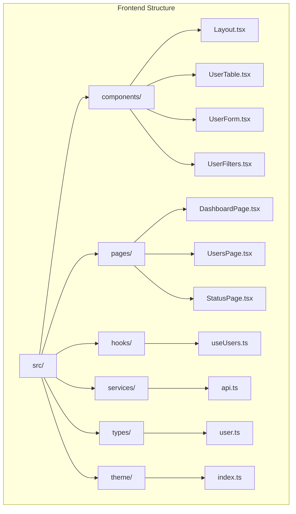
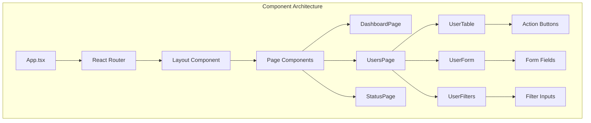
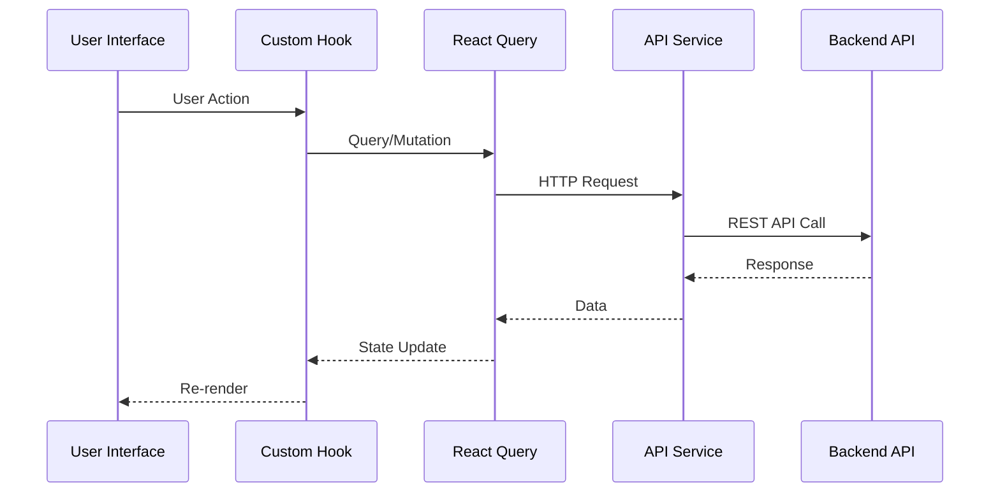

# Documentação do Frontend - User Management

**Autor:** Agente de Desenvolvimento  
**Data:** 2024-01-15  
**Versão:** 1.0.0  

## Sumário

- [Resumo Executivo](#resumo-executivo)
- [Contexto](#contexto)
- [Arquitetura](#arquitetura)
- [Tecnologias](#tecnologias)
- [Estrutura do Projeto](#estrutura-do-projeto)
- [Componentes](#componentes)
- [Hooks](#hooks)
- [Serviços](#serviços)
- [Páginas](#páginas)
- [Tema e Estilização](#tema-e-estilização)
- [Roteamento](#roteamento)
- [Gerenciamento de Estado](#gerenciamento-de-estado)
- [Formulários](#formulários)
- [Tratamento de Erros](#tratamento-de-erros)
- [Performance](#performance)
- [Acessibilidade](#acessibilidade)
- [Testes](#testes)
- [Build e Deploy](#build-e-deploy)
- [Desenvolvimento](#desenvolvimento)
- [Troubleshooting](#troubleshooting)

## Resumo Executivo

O frontend da User Management Application é uma Single Page Application (SPA) construída com React 19, TypeScript e Chakra UI. A aplicação oferece uma interface moderna e responsiva para gerenciamento de usuários, com funcionalidades completas de CRUD, busca avançada e estatísticas em tempo real.

### Características Principais:
- **Framework**: React 19 com TypeScript
- **UI Library**: Chakra UI v3
- **State Management**: React Query (TanStack Query)
- **Formulários**: React Hook Form com Yup
- **Roteamento**: React Router v7
- **HTTP Client**: Axios
- **Build Tool**: Create React App

## Contexto

### Objetivo
Fornecer uma interface de usuário intuitiva e responsiva para:
- Gerenciamento completo de usuários (CRUD)
- Visualização de dados em tabelas e formulários
- Busca e filtros avançados
- Estatísticas e relatórios visuais
- Experiência de usuário moderna e acessível

### Padrões Adotados
- **Component-Based Architecture**: Componentes reutilizáveis
- **Custom Hooks**: Lógica de estado encapsulada
- **Type Safety**: TypeScript para prevenção de erros
- **Responsive Design**: Interface adaptável
- **Accessibility**: Componentes acessíveis
- **Performance**: Otimizações de renderização

## Arquitetura do Frontend

### Estrutura de Pastas



### Arquitetura de Componentes



### Fluxo de Dados



## Tecnologias e Dependências

### Core Dependencies

```json
{
  "react": "^19.1.1",
  "react-dom": "^19.1.1",
  "typescript": "^4.9.5"
}
```

### UI and Styling

```json
{
  "@chakra-ui/react": "^3.27.0",
  "@chakra-ui/icons": "^2.2.4",
  "@emotion/react": "^11.14.0",
  "@emotion/styled": "^11.14.1",
  "framer-motion": "^12.23.22"
}
```

### State Management

```json
{
  "@tanstack/react-query": "^5.90.2",
  "react-hook-form": "^7.63.0",
  "@hookform/resolvers": "^5.2.2",
  "yup": "^1.7.1"
}
```

### HTTP and Routing

```json
{
  "axios": "^1.12.2",
  "react-router-dom": "^7.9.3"
}
```

### Utilities

```json
{
  "date-fns": "^4.1.0",
  "react-icons": "^5.5.0",
  "recharts": "^3.2.1"
}
```

## Componentes Principais

### 1. Layout Component

**Arquivo**: `src/components/Layout.tsx`

Componente principal que define a estrutura da aplicação.

```typescript
interface LayoutProps {
  children: React.ReactNode
}

export const Layout: React.FC<LayoutProps> = ({ children }) => {
  return (
    <Box minH="100vh" bg="gray.50">
      <Header />
      <Container maxW="container.xl" py={8}>
        {children}
      </Container>
      <Footer />
    </Box>
  )
}
```

**Características:**
- Header com navegação
- Container responsivo
- Footer com informações
- Layout consistente

### 2. UserTable Component

**Arquivo**: `src/components/UserTable.tsx`

Tabela responsiva para exibição de usuários com ações.

```typescript
interface UserTableProps {
  users: User[]
  isLoading?: boolean
  onEdit: (user: User) => void
  onView?: (user: User) => void
}
```

**Funcionalidades:**
- Exibição de dados em tabela
- Ações de editar, visualizar, ativar/desativar e deletar
- Loading states com skeletons
- Confirmação de exclusão
- Formatação de datas
- Status badges

**Exemplo de Uso:**
```typescript
<UserTable
  users={users}
  isLoading={isLoading}
  onEdit={handleEdit}
  onView={handleView}
/>
```

### 3. UserForm Component

**Arquivo**: `src/components/UserForm.tsx`

Formulário modal para criação e edição de usuários.

```typescript
interface UserFormProps {
  isOpen: boolean
  onClose: () => void
  user?: User | null
  mode: 'create' | 'edit'
}
```

**Funcionalidades:**
- Validação com Yup schema
- Formatação automática de telefone
- Campos obrigatórios e opcionais
- Estados de loading
- Tratamento de erros

**Validações:**
```typescript
const userSchema = yup.object({
  name: yup.string().required('Nome é obrigatório').min(2).max(100),
  email: yup.string().required('Email é obrigatório').email(),
  phone: yup.string().nullable().test('phone-format', 'Formato inválido', (value) => {
    if (!value) return true
    const phoneRegex = /^(\(\d{2}\)\s?\d{4,5}-?\d{4}|\d{10,11})$/
    return phoneRegex.test(value)
  }),
  age: yup.number().required('Idade é obrigatória').min(0).max(120).integer(),
  active: yup.boolean().required()
})
```

### 4. UserFilters Component

**Arquivo**: `src/components/UserFilters.tsx`

Componente para filtros e busca de usuários.

```typescript
interface UserFiltersProps {
  onFilter: (filters: UserFilters) => void
  onClear: () => void
}
```

**Funcionalidades:**
- Busca por nome
- Filtro por faixa etária
- Filtro por status (ativo/inativo)
- Limpeza de filtros
- Debounce na busca

## Hooks Customizados

### 1. useUsers Hook

**Arquivo**: `src/hooks/useUsers.ts`

Hook principal para gerenciamento de estado dos usuários.

```typescript
// Query keys para cache
export const userKeys = {
  all: ['users'] as const,
  lists: () => [...userKeys.all, 'list'] as const,
  list: (filters: UserFilters) => [...userKeys.lists(), filters] as const,
  details: () => [...userKeys.all, 'detail'] as const,
  detail: (id: number) => [...userKeys.details(), id] as const,
  stats: () => [...userKeys.all, 'stats'] as const,
  active: () => [...userKeys.all, 'active'] as const,
  inactive: () => [...userKeys.all, 'inactive'] as const,
}
```

**Hooks Disponíveis:**

#### useUsers
```typescript
export const useUsers = (filters?: UserFilters) => {
  return useQuery({
    queryKey: userKeys.list(filters || {}),
    queryFn: () => userService.getUsers(filters),
    staleTime: 5 * 60 * 1000, // 5 minutes
  })
}
```

#### useCreateUser
```typescript
export const useCreateUser = () => {
  const queryClient = useQueryClient()
  const toast = useToast()

  return useMutation({
    mutationFn: (userData: CreateUserRequest) => userService.createUser(userData),
    onSuccess: (newUser) => {
      queryClient.invalidateQueries({ queryKey: userKeys.lists() })
      queryClient.invalidateQueries({ queryKey: userKeys.stats() })
      
      toast({
        title: 'Usuário criado com sucesso!',
        description: `${newUser.name} foi adicionado ao sistema.`,
        status: 'success',
        duration: 5000,
        isClosable: true,
      })
    },
    onError: (error: any) => {
      toast({
        title: 'Erro ao criar usuário',
        description: error.response?.data?.message || 'Ocorreu um erro inesperado.',
        status: 'error',
        duration: 5000,
        isClosable: true,
      })
    },
  })
}
```

#### useUpdateUser
```typescript
export const useUpdateUser = () => {
  const queryClient = useQueryClient()
  const toast = useToast()

  return useMutation({
    mutationFn: ({ id, userData }: { id: number; userData: CreateUserRequest }) =>
      userService.updateUser(id, userData),
    onSuccess: (updatedUser) => {
      queryClient.setQueryData(userKeys.detail(updatedUser.id), updatedUser)
      queryClient.invalidateQueries({ queryKey: userKeys.lists() })
      queryClient.invalidateQueries({ queryKey: userKeys.stats() })
      
      toast({
        title: 'Usuário atualizado com sucesso!',
        description: `Os dados de ${updatedUser.name} foram atualizados.`,
        status: 'success',
        duration: 5000,
        isClosable: true,
      })
    },
    onError: (error: any) => {
      toast({
        title: 'Erro ao atualizar usuário',
        description: error.response?.data?.message || 'Ocorreu um erro inesperado.',
        status: 'error',
        duration: 5000,
        isClosable: true,
      })
    },
  })
}
```

## Services

### API Service

**Arquivo**: `src/services/api.ts`

Serviço para comunicação com a API backend.

```typescript
const API_BASE_URL = process.env.REACT_APP_API_URL || 'http://localhost:8080/api'

const api = axios.create({
  baseURL: API_BASE_URL,
  headers: {
    'Content-Type': 'application/json',
  },
})

// Request interceptor para logging
api.interceptors.request.use(
  (config) => {
    console.log(`Making ${config.method?.toUpperCase()} request to ${config.url}`)
    return config
  },
  (error) => {
    return Promise.reject(error)
  }
)

// Response interceptor para error handling
api.interceptors.response.use(
  (response) => response,
  (error) => {
    console.error('API Error:', error.response?.data || error.message)
    return Promise.reject(error)
  }
)
```

**Métodos Disponíveis:**

```typescript
export const userService = {
  // Get all users
  getUsers: async (filters?: UserFilters): Promise<User[]> => {
    const params = new URLSearchParams()
    
    if (filters?.name) params.append('name', filters.name)
    if (filters?.minAge) params.append('minAge', filters.minAge.toString())
    if (filters?.maxAge) params.append('maxAge', filters.maxAge.toString())
    
    const queryString = params.toString()
    const url = queryString ? `/users/search?${queryString}` : '/users'
    
    const response = await api.get(url)
    return response.data
  },

  // Get user by ID
  getUserById: async (id: number): Promise<User> => {
    const response = await api.get(`/users/${id}`)
    return response.data
  },

  // Create user
  createUser: async (userData: CreateUserRequest): Promise<User> => {
    const response = await api.post('/users', userData)
    return response.data
  },

  // Update user
  updateUser: async (id: number, userData: CreateUserRequest): Promise<User> => {
    const response = await api.put(`/users/${id}`, userData)
    return response.data
  },

  // Delete user
  deleteUser: async (id: number): Promise<void> => {
    await api.delete(`/users/${id}`)
  },

  // Activate user
  activateUser: async (id: number): Promise<User> => {
    const response = await api.patch(`/users/${id}/activate`)
    return response.data
  },

  // Deactivate user
  deactivateUser: async (id: number): Promise<User> => {
    const response = await api.patch(`/users/${id}/deactivate`)
    return response.data
  },

  // Get user statistics
  getUserStats: async (): Promise<UserStats> => {
    const response = await api.get('/users/stats')
    return response.data
  },

  // Get active users
  getActiveUsers: async (): Promise<User[]> => {
    const response = await api.get('/users/active')
    return response.data
  },

  // Get inactive users
  getInactiveUsers: async (): Promise<User[]> => {
    const response = await api.get('/users/inactive')
    return response.data
  },

  // Search users by age range
  getUsersByAgeRange: async (minAge: number, maxAge: number): Promise<User[]> => {
    const response = await api.get(`/users/age-range?minAge=${minAge}&maxAge=${maxAge}`)
    return response.data
  },
}
```

## Types

### User Types

**Arquivo**: `src/types/user.ts`

```typescript
export interface User {
  id: number
  name: string
  email: string
  phone?: string
  age?: number
  active: boolean
  createdAt: string
  updatedAt?: string
}

export interface CreateUserRequest {
  name: string
  email: string
  phone?: string
  age?: number
  active?: boolean
}

export interface UpdateUserRequest extends CreateUserRequest {
  id: number
}

export interface UserFilters {
  name?: string
  minAge?: number
  maxAge?: number
  active?: boolean
}

export interface UserStats {
  totalUsers: number
  activeUsers: number
  inactiveUsers: number
}
```

## Theme e Styling

### Chakra UI Theme

**Arquivo**: `src/theme/index.ts`

```typescript
import { extendTheme } from '@chakra-ui/react'

const theme = extendTheme({
  colors: {
    brand: {
      50: '#e6f3ff',
      100: '#b3d9ff',
      200: '#80bfff',
      300: '#4da6ff',
      400: '#1a8cff',
      500: '#0066cc',
      600: '#0052a3',
      700: '#003d7a',
      800: '#002952',
      900: '#001429',
    },
  },
  fonts: {
    heading: 'Inter, sans-serif',
    body: 'Inter, sans-serif',
  },
  components: {
    Button: {
      defaultProps: {
        colorScheme: 'brand',
      },
    },
    Input: {
      defaultProps: {
        focusBorderColor: 'brand.500',
      },
    },
  },
})

export default theme
```

## Páginas

### 1. DashboardPage

**Arquivo**: `src/pages/DashboardPage.tsx`

Página principal com visão geral e estatísticas.

```typescript
export const DashboardPage: React.FC = () => {
  const { data: stats, isLoading: statsLoading } = useUserStats()
  const { data: recentUsers, isLoading: usersLoading } = useUsers()

  return (
    <VStack spacing={8} align="stretch">
      <Heading size="lg" color="gray.700">
        Dashboard
      </Heading>
      
      <StatsCards stats={stats} isLoading={statsLoading} />
      
      <RecentUsersTable 
        users={recentUsers?.slice(0, 5)} 
        isLoading={usersLoading} 
      />
    </VStack>
  )
}
```

### 2. UsersPage

**Arquivo**: `src/pages/UsersPage.tsx`

Página principal de gerenciamento de usuários.

```typescript
export const UsersPage: React.FC = () => {
  const [filters, setFilters] = useState<UserFilters>({})
  const [isFormOpen, setIsFormOpen] = useState(false)
  const [editingUser, setEditingUser] = useState<User | null>(null)
  const [formMode, setFormMode] = useState<'create' | 'edit'>('create')

  const { data: users, isLoading } = useUsers(filters)

  const handleEdit = (user: User) => {
    setEditingUser(user)
    setFormMode('edit')
    setIsFormOpen(true)
  }

  const handleCreate = () => {
    setEditingUser(null)
    setFormMode('create')
    setIsFormOpen(true)
  }

  const handleCloseForm = () => {
    setIsFormOpen(false)
    setEditingUser(null)
  }

  return (
    <VStack spacing={6} align="stretch">
      <HStack justify="space-between">
        <Heading size="lg" color="gray.700">
          Usuários
        </Heading>
        <Button
          colorScheme="brand"
          leftIcon={<AddIcon />}
          onClick={handleCreate}
        >
          Novo Usuário
        </Button>
      </HStack>

      <UserFilters onFilter={setFilters} onClear={() => setFilters({})} />

      <UserTable
        users={users || []}
        isLoading={isLoading}
        onEdit={handleEdit}
      />

      <UserForm
        isOpen={isFormOpen}
        onClose={handleCloseForm}
        user={editingUser}
        mode={formMode}
      />
    </VStack>
  )
}
```

### 3. StatusPage

**Arquivo**: `src/pages/StatusPage.tsx`

Página de status e monitoramento da aplicação.

```typescript
export const StatusPage: React.FC = () => {
  const { data: stats, isLoading } = useUserStats()

  return (
    <VStack spacing={6} align="stretch">
      <Heading size="lg" color="gray.700">
        Status da Aplicação
      </Heading>
      
      <Grid templateColumns="repeat(auto-fit, minmax(300px, 1fr))" gap={6}>
        <StatusCard
          title="Sistema"
          status="online"
          description="Aplicação funcionando normalmente"
        />
        
        <StatusCard
          title="API"
          status="online"
          description="Backend respondendo corretamente"
        />
        
        <StatusCard
          title="Banco de Dados"
          status="online"
          description="Conexão com H2 estabelecida"
        />
      </Grid>

      <StatsOverview stats={stats} isLoading={isLoading} />
    </VStack>
  )
}
```

## Performance e Otimizações

### 1. React Query Configuration

```typescript
const queryClient = new QueryClient({
  defaultOptions: {
    queries: {
      retry: 1,
      refetchOnWindowFocus: false,
      staleTime: 5 * 60 * 1000, // 5 minutes
    },
  },
})
```

### 2. Code Splitting

```typescript
// Lazy loading de páginas
const DashboardPage = lazy(() => import('./pages/DashboardPage'))
const UsersPage = lazy(() => import('./pages/UsersPage'))
const StatusPage = lazy(() => import('./pages/StatusPage'))

// Uso com Suspense
<Suspense fallback={<Spinner />}>
  <Routes>
    <Route path="/" element={<DashboardPage />} />
    <Route path="/users" element={<UsersPage />} />
    <Route path="/status" element={<StatusPage />} />
  </Routes>
</Suspense>
```

### 3. Memoization

```typescript
// Memoização de componentes pesados
const UserTable = React.memo<UserTableProps>(({ users, isLoading, onEdit }) => {
  // Component implementation
})

// Memoização de callbacks
const handleEdit = useCallback((user: User) => {
  setEditingUser(user)
  setFormMode('edit')
  setIsFormOpen(true)
}, [])
```

### 4. Virtual Scrolling (para listas grandes)

```typescript
import { FixedSizeList as List } from 'react-window'

const VirtualizedUserList = ({ users }: { users: User[] }) => {
  const Row = ({ index, style }: { index: number; style: React.CSSProperties }) => (
    <div style={style}>
      <UserRow user={users[index]} />
    </div>
  )

  return (
    <List
      height={600}
      itemCount={users.length}
      itemSize={60}
      width="100%"
    >
      {Row}
    </List>
  )
}
```

## Acessibilidade

### 1. ARIA Labels

```typescript
<IconButton
  aria-label="Editar usuário"
  icon={<EditIcon />}
  onClick={() => onEdit(user)}
/>
```

### 2. Keyboard Navigation

```typescript
// Navegação por teclado em tabelas
const handleKeyDown = (event: KeyboardEvent, user: User) => {
  if (event.key === 'Enter' || event.key === ' ') {
    event.preventDefault()
    onEdit(user)
  }
}
```

### 3. Focus Management

```typescript
// Gerenciamento de foco em modais
const initialFocusRef = useRef<HTMLInputElement>(null)

<Modal initialFocusRef={initialFocusRef}>
  <ModalContent>
    <Input ref={initialFocusRef} />
  </ModalContent>
</Modal>
```

### 4. Color Contrast

```typescript
// Uso de cores com contraste adequado
const theme = extendTheme({
  colors: {
    brand: {
      500: '#0066cc', // Contraste adequado
    },
  },
})
```

## Responsividade

### 1. Breakpoints

```typescript
// Uso de breakpoints do Chakra UI
<Grid
  templateColumns={{
    base: '1fr',
    md: 'repeat(2, 1fr)',
    lg: 'repeat(3, 1fr)',
  }}
  gap={6}
>
  {cards.map(card => <Card key={card.id} {...card} />)}
</Grid>
```

### 2. Mobile-First Design

```typescript
// Design mobile-first
<Stack
  direction={{ base: 'column', md: 'row' }}
  spacing={4}
  align={{ base: 'stretch', md: 'center' }}
>
  <Input placeholder="Buscar usuários" />
  <Button>Filtrar</Button>
</Stack>
```

### 3. Touch-Friendly Interface

```typescript
// Botões com tamanho adequado para touch
<IconButton
  size="lg"
  minW="44px"
  minH="44px"
  aria-label="Ação"
  icon={<EditIcon />}
/>
```

## Testes

### 1. Testing Library Setup

```typescript
// setupTests.ts
import '@testing-library/jest-dom'
import { ChakraProvider } from '@chakra-ui/react'
import { QueryClient, QueryClientProvider } from '@tanstack/react-query'

const queryClient = new QueryClient({
  defaultOptions: {
    queries: { retry: false },
    mutations: { retry: false },
  },
})

const AllTheProviders = ({ children }: { children: React.ReactNode }) => {
  return (
    <ChakraProvider>
      <QueryClientProvider client={queryClient}>
        {children}
      </QueryClientProvider>
    </ChakraProvider>
  )
}

export { AllTheProviders }
```

### 2. Component Tests

```typescript
// UserTable.test.tsx
import { render, screen, fireEvent } from '@testing-library/react'
import { AllTheProviders } from '../setupTests'
import { UserTable } from './UserTable'

const mockUsers = [
  {
    id: 1,
    name: 'João Silva',
    email: 'joao@email.com',
    phone: '11999999999',
    age: 30,
    active: true,
    createdAt: '2024-01-15T10:30:00',
  },
]

test('renders user table with data', () => {
  render(
    <AllTheProviders>
      <UserTable users={mockUsers} onEdit={jest.fn()} />
    </AllTheProviders>
  )

  expect(screen.getByText('João Silva')).toBeInTheDocument()
  expect(screen.getByText('joao@email.com')).toBeInTheDocument()
})

test('calls onEdit when edit button is clicked', () => {
  const mockOnEdit = jest.fn()
  
  render(
    <AllTheProviders>
      <UserTable users={mockUsers} onEdit={mockOnEdit} />
    </AllTheProviders>
  )

  fireEvent.click(screen.getByLabelText('Editar usuário'))
  expect(mockOnEdit).toHaveBeenCalledWith(mockUsers[0])
})
```

### 3. Hook Tests

```typescript
// useUsers.test.tsx
import { renderHook, waitFor } from '@testing-library/react'
import { QueryClient, QueryClientProvider } from '@tanstack/react-query'
import { useUsers } from './useUsers'
import { userService } from '../services/api'

jest.mock('../services/api')
const mockUserService = userService as jest.Mocked<typeof userService>

test('fetches users successfully', async () => {
  const mockUsers = [
    { id: 1, name: 'João Silva', email: 'joao@email.com', active: true, createdAt: '2024-01-15T10:30:00' }
  ]
  
  mockUserService.getUsers.mockResolvedValue(mockUsers)

  const queryClient = new QueryClient({
    defaultOptions: { queries: { retry: false } },
  })

  const wrapper = ({ children }: { children: React.ReactNode }) => (
    <QueryClientProvider client={queryClient}>
      {children}
    </QueryClientProvider>
  )

  const { result } = renderHook(() => useUsers(), { wrapper })

  await waitFor(() => {
    expect(result.current.isSuccess).toBe(true)
  })

  expect(result.current.data).toEqual(mockUsers)
})
```

## Build e Deploy

### 1. Environment Variables

```bash
# .env.development
REACT_APP_API_URL=http://localhost:8080/api
REACT_APP_ENV=development

# .env.production
REACT_APP_API_URL=https://api.example.com/api
REACT_APP_ENV=production
```

### 2. Build Scripts

```json
{
  "scripts": {
    "start": "react-scripts start",
    "build": "react-scripts build",
    "test": "react-scripts test",
    "eject": "react-scripts eject",
    "build:prod": "NODE_ENV=production react-scripts build",
    "analyze": "npm run build && npx bundle-analyzer build/static/js/*.js"
  }
}
```

### 3. Docker Configuration

```dockerfile
# Dockerfile.frontend
FROM node:18-alpine as build

WORKDIR /app
COPY package*.json ./
RUN npm ci --only=production

COPY . .
RUN npm run build

FROM nginx:alpine
COPY --from=build /app/build /usr/share/nginx/html
COPY nginx.conf /etc/nginx/nginx.conf
EXPOSE 80
CMD ["nginx", "-g", "daemon off;"]
```

## Riscos e Considerações

### 1. Performance

**Riscos:**
- Bundle size grande com muitas dependências
- Re-renders desnecessários
- Memory leaks em componentes não limpos

**Mitigações:**
- Code splitting e lazy loading
- Memoização de componentes
- Cleanup de event listeners
- Bundle analysis regular

### 2. Acessibilidade

**Riscos:**
- Componentes não acessíveis
- Contraste de cores inadequado
- Navegação por teclado limitada

**Mitigações:**
- Testes de acessibilidade
- Uso de ferramentas como axe-core
- Revisão de design com foco em acessibilidade

### 3. Manutenibilidade

**Riscos:**
- Código duplicado
- Componentes muito complexos
- Falta de documentação

**Mitigações:**
- Componentes reutilizáveis
- Custom hooks para lógica compartilhada
- Documentação de componentes
- Code reviews regulares

## Referências

- [React Documentation](https://react.dev/)
- [Chakra UI Documentation](https://chakra-ui.com/)
- [React Query Documentation](https://tanstack.com/query/latest)
- [React Hook Form Documentation](https://react-hook-form.com/)
- [TypeScript Documentation](https://www.typescriptlang.org/)
- [Testing Library Documentation](https://testing-library.com/)
- [React Router Documentation](https://reactrouter.com/)
- [Axios Documentation](https://axios-http.com/)
